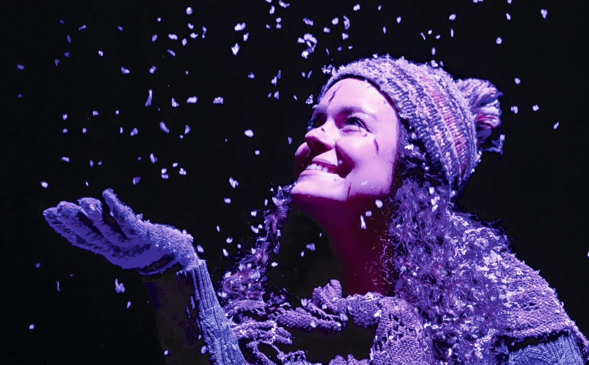
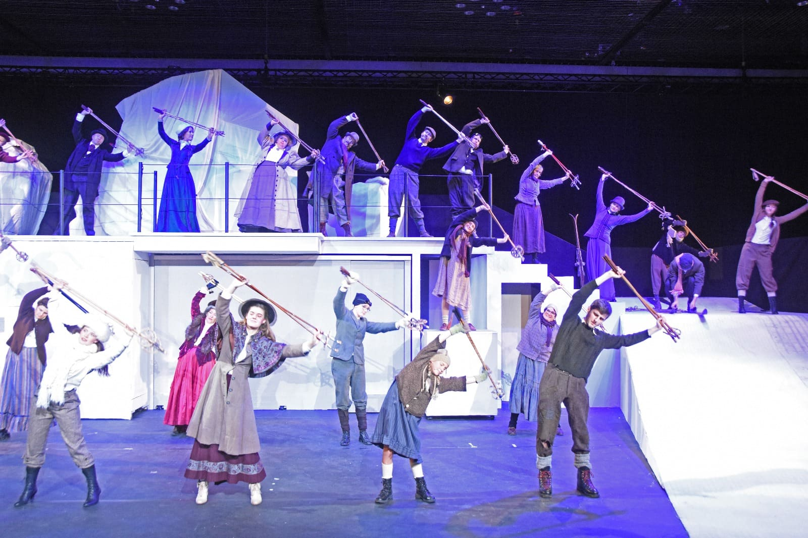
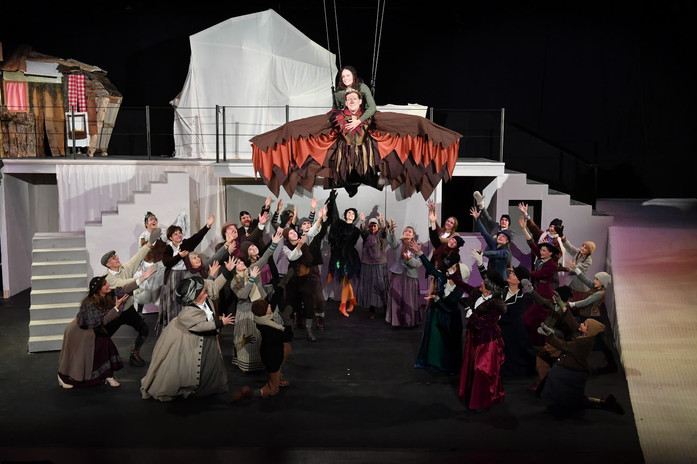

+++
title = "Wenn ein König fliegen lernt "
date = "2024-01-29"
draft = false
pinned = false
tags = ["Reportage"]
image = "5vogellisi_schneeflocken_quer-1-.jpg"
description = "Wenn die Lichter im Saal ausgehen und die Scheinwerfer an, wenn die Schauspieler zu singen und tanzen beginnen und mit ihrer Kunst die weisse Landschaft zum Leben erwecken, dann wird das ‘Vogellisi und der König der Lüfte’ doch noch auf der Bühne präsentiert."
+++
 

Wenn die Lichter im Saal ausgehen und die Scheinwerfer an, wenn die Schauspieler zu singen und tanzen beginnen und mit ihrer Kunst die weisse Landschaft zum Leben erwecken, dann wird das ‘Vogellisi und der König der Lüfte’ doch noch auf der Bühne präsentiert. 
 

Anna Mürner und Erine Raedler

Wir befinden uns in einem kleinen Saal, die Tribüne ist ein Gerüst aus Holzplanken und Metall. Aneinander reihen sich blaue Stühle, die eher klein sind, auch für Jugendliche, mit weichen lila Kissen, die die Stuhl Grösse entschuldigen. Der Saal ist beleuchtet, die Bühne dunkel und unberührt und es scheint, als wäre die weisse Konstruktion von Treppen, Hügeln und einer Bank neben einem einfachen Baum auf Rädern am Schlafen. Als die Lichter im Saal ausgehen kündigt der Sprecher des Ski-Weltcups Adelboden ein Lauf eines Skirennens an doch bald wird er abgelöst vor einer beruhigenden Frauenstimme, die uns in die Zeit, in der das Stück spielt, einführt. Sie erzählt, wie es damals war, als das Vogellisi gelebt hatte. Ein einzelner Lichtstrahl erscheint, darin steht das Vogellisi. Sie dreht sich im herabfallenden Schnee und die Show beginnt.  

### Eine Idee wird gelegt

Als Zuschauer\*in beginnt die Vorbereitung vielleicht zwei Stunden vor dem Beginn der Aufführung, mit der Frage, was man wohl in der Kälte anziehen sollte, ob man einen Schirm braucht und welchen Zug man denn nehmen muss. Für die Schauspieler\*innen und vor allem die Regisseurin beginnt sie allerdings schon im Frühling, also Monate vorher. Ganz genau aber ist das Stück schon seit knapp 3 Jahren ein Thema, das ursprünglich nur als Hörbuch gedacht war, dessen Vernissage im Oktober 2021 stattfand. Damals dachte man, dass dieses Projekt nun abgeschlossen ist, da man nach der vorherigen Produktion klar war, dass man nun vom Thema des Vogellisi wegkommen musste, doch alles kam anders.  Denn es liess Annemarie Stähli, die Regisseurin und Autorin des Stückes und Gründerin der Oberländer Märlibühni, nicht kalt. «Diese wahnsinnigen Bilder, welche ich beim Schreiben kreiert hatte, sind immer wieder gekommen. Ich dachte dann es wäre so wahnsinnig spannend dies umzusetzen.» meinte sie über die Entscheidung, das Stück doch noch auf die Bühne zu bringen. Annemarie ist mit dem Thema Vogellisi persönlich verbunden, denn sie wuchs in Adelboden auf und auch das Thema der Kurgäste, welche im Stück eine grössere Rolle spielen, hat in ihr schon von klein auf ihre Faszination geweckt. Als Tochter des Hoteliers, welcher ein Hotel in Adelboden führte, erlebte sie als junges Mädchen, wie sich die Kurgäste verhielten und konnte so auch einige Anekdoten in ihre Geschichten einfliessen lassen. Dennoch ist es ihr wichtig, dass ihre Geschichten auch einen magischen respektive märchenhaften Aspekt haben. 

Etwa ein Jahr vor der Premiere begann das Ausbrüten des Stücks für die Schauspieler\*innen. Im November 22 wurde sehr kurzfristig entschieden, dass es Weihnachten 23 ein Wintermärchen im KKThun geben wird. Im März 23 war das Casting und danach fingen die Proben schon bald an. Damals probten die Darsteller\*innen in einem Schulhaus in Steffisburg, bis dann im Sommer das Bühnenbild vorläufig in einer Fabrikhalle in Heimberg aufgebaut wurde. Als die Bühne endlich im KKThun war, konnten sie richtig loslegen und die Mitwirkenden sahen das volle Ausmass der außergewöhnlichen Bühne die unter anderem eine bewegliche Treppe, eine Nebelmaschine, ein durchsichtiges Schaufenster mit einem geschmückten Laden und eine kleine Skipiste eingebaut hatte, auch konnten endlich die Szenen mit dem herunterfallenden Schnee und den schwebenden Schauspielern geübt werden. 

> « Diese wahnsinnigen Bilder, welche ich beim Schreiben kreiert hatte, sind immer wieder gekommen.» 
>
> Annemarie Stähli, Regisseurin der Oberländer Märlibühni

### Das Küken ist geschlüpft

Die Schauspieler\*innen brauchen bis zu 2,5 Stunden, um ihr Kostüm anzuziehen, in die Maske zu gehen und sich in die Rolle hineinzuversetzen. Dies geschieht in einem Luftschutzbunker der Armee unter dem KKThun, welcher nur durch die Garage betretbar ist. Der Stress ist den Performer\*innen kaum anzusehen, in der Maske wird über den Energydrink Konsum der heutigen Jugend gesprochen, jüngere Darsteller*innen helfen andere mit ihren Kostümen oder sitzen etwas gelangweilt auf dem Sofa. Bilder vorheriger Veranstaltungen hängen an den sonst kahlen Wänden, auf den Tischen liegen Dankeskarten, Getränke oder angeschriebene Mikrofone. 

Die Sänger\*innen müssen sich einsingen, auch ein Soundcheck muss gemacht werden, welcher eine halbe Stunde vor der Aufführung stattfindet. Annemarie kommt meistens auch in die Garderobe und plaudert mit den Schauspieler\*innen. Wenn alle anwesend sind, liest sie Kritik vor, um Motivation zu spenden und erzählt, wer heute im Publikum sitzt. Dies ist wichtig für Hubi, ein aufbrausender Charakter, dessen Improvisation-Text immer dem Publikum angepasst wird. Anschliessend kommt das Wichtigste: der Schlachtruf, der bestimmte Zeilen aus dem Text aufnimmt, bevor es dann in Richtung Saal geht. Hinter der Bühne spähen manche hinter dem Vorhang hervor, um Verwandte oder Bekannte im Publikum zu entdecken, doch die meisten versetzen sich noch einmal in ihre Rolle und gehen auf ihre Plätze. Das letzte Mal wird geprüft, ob die Perücke sitzt, das Make-up stimmt und das Kostüm richtig getragen wird. Auch wichtig ist, dass keine Uhren oder nicht in die Zeit passenden Schmuck zu sehen sind. Dann geht es auch für die Schauspieler*innen endlich los.

### Wenni numä wüsst...

Das berühmte Lied zum Vogellisi ertönt gleich am Anfang der Aufführung, unterbrochen vom Sprecher. Darauffolgend erklingt die Stimme von Annemarie in der Funktion einer Erzählerin, die uns in die Geschichte einführt und uns in seinen Bann zieht. Die ersten Szenen bauen das Stück auf und spätestens bei der ersten Massenszene kommt man zusammen mit allen Kurgästen auch im Adelboden des späten 19. Jahrhunderts an. Im Rampenlicht wirken die Charaktere ruhig, doch hinter der Bühne ziehen einige innerhalb von Minuten ein anderes Kostüm an oder schminken sich nach und andere müssen zum richtigen Zeitpunkt etwas an der Bühne umbauen. 

Die Bühne ist sehr vielfältig gestaltet, indem viele Teile verschiebbar sind. Ob es nur um das Schaufenster oder die Treppe zu verschieben geht, die Umbauten müssen gut geprobt werden, denn sie sollten leise, geschmeidig und schnell ablaufen. Dies ist die höchste Priorität. Gesprochen darf während dieser Umbauten auch nur das Nötigste, prinzipiell sollte hinter der Bühne nur geflüstert oder am besten gar nicht gesprochen werden. Dennoch wird hinter der Bühne der Text im Flüsterton mitgesprochen, bei den Liedern mitgesungen oder zumindest die Lippen bewegt. Eine Gruppe entwickelte sogar eine ganze Choreo zu einem der Songs, die bis zum Ende der Produktion alle tanzten, die nicht auf der Bühne waren.

In der Pause geht es für einige noch weiter, denn die Besucher\*innen müssen im Bistro verpflegt werden. Das Bistro ist mit Tannenbäumen, alten Skis und Schlitten, Lichterketten und Watte als Schnee geschmückt. So verlässt einen die Märchenweltstimmung nie so ganz. Neben dem Bistro in einem kleinen Pop-up-Store verkaufen einige Schauspieler\*innen Schokolade und Fan-Artikel. Auch dieser ist bis ins Detail dekoriert. Kostümierte Kinder läuten mit einer Kuh Glocke das Ende der Pause ein.  

Als die Show weitergeht, warten alle Schauspieler*innen, welche gerade nicht auf der Bühne sind gespannt auf den Improvisationtext. Danach geht auch die Achterbahnfahrt der Gefühle weiter. Auf eine sehr lustige Szene folgte ein herzzerreissendes Gespräch, doch wie in den meisten Theatern, gibt es auch hier ein Happy End. Der Adler lernt doch noch fliegen und hebt mit Lisi auf dem Rücken ab. 

### Hoch geflogen und heil gelandet

Als die Musik ihren Höhepunkt erreicht, schwebt das Vogellisi auf dem Rücken des Adlers Volar hoch in die Lüfte. Die Tänzer drehen sich noch ein letztes Mal und gehen in die Knie, auch der Adler landet und verbeugt sich, als die Musik versiegt und das Licht ausgeht. Das Licht geht wieder an, alle Schauspieler\*innen stehen aufgereiht auf der Bühne und verbeugen sich gemeinsam, danach in Gruppen. Nach den Hauptrollen verbeugt sich Annemarie. Die Bühnenarbeiter\*innen, die Techniker, die Kostümverantwortliche und die Bistro-Leiterin gehen auch auf die Bühne und verbeugen sich, denn ohne sie wäre die ganze Produktion unmöglich gewesen. Als das Saallicht wieder an geht wird man beim Ausgang von den Schauspieler*innen Spalier stehend verabschiedet und wenn man nun aus der Märchenwelt schreitet, landet man zurück an einem dunklen Winterabend vor dem KKThun.



### Die Geschichte vom Vogellisi

Im Sommer 2017 und 2018 wurde das Stück ‘Vogellisi, ein Naturmarchen’ als Freilichttheater aufgeführt. In diesem Stück geht es um Lisi, die ihre grosse Liebe findet. 

Im Frühling 2022 wurde ‘Der grosse Traum’ aufgeführt. Dort wanderten 4 Adelbodner nach Amerika aus und suchten dort ihr Glück. Zwei der Auswanderer sind die Eltern von Lisi und finden in Amerika zueinander. Aufgrund von Heimweh kommen sie wieder zurück. 

In der Weihnachtszeit 2023 wurde dann im KKThun das ‘Vogellisi und der König der Lüfte’ aufgeführt. Dort wird die Geschichte erzählt, wie Lisi zu ihrem Namen als Vogellisi kommt. Sie rettet eine kleinen, verletzten Adler, auf welchem sie am Ende fliegt.

