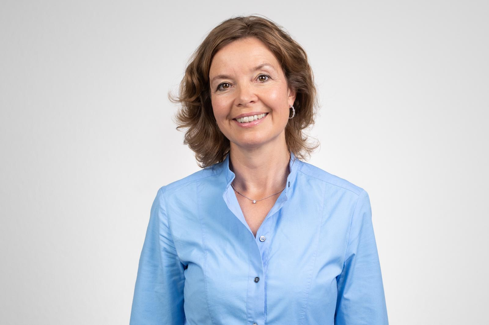

+++
title = "Von negativem Feedback und wahnsinnigen Bildern"
date = "2024-02-27"
draft = false
pinned = false
tags = ["Reportage"]
image = "whatsapp-bild-2024-02-27-um-15.14.29_ea222bcf.jpg"
description = "Aus dem Nähkästchen erzählt Annemarie Stähli, was damals mit ihr passierte. Damals als der Entscheid fiel «Vogellisi und der König der Lüfte» doch noch auf die Bühne zu bringen."
+++
 Aus dem Nähkästchen erzählt Annemarie Stähli, was damals mit ihr passierte. Damals als der Entscheid fiel «Vogellisi und der König der Lüfte» doch noch auf die Bühne zu bringen.


Anna Mürner und Erine Raedler

Es ist hell in der Aula der Schule Steffisburg, wo Annemarie normalerweise mit ihren Schülerinnen probt, doch heute wird nicht geprobt, sondern erzählt. Nämlich die Geschichte, wie es dazu kam , ‘Vogellisi und der König der Lüfte’ auf die Bühne des KKThun kam. Denn dies war lange nicht geplant oder überhaupt vorgesehen.

### Wie bist du auf das Thema Vogellisi gekommen? Was fasziniert dich daran?

Mich faszinieren die zwei Welten, einerseits die historische Welt, welche schon in «Vogellisi ein Naturmärchen» und auch beim grossen Traum und bei König der Lüfte eine sehr starke Rolle gespielt hat: Also die ganze Entwicklung vom Tourismus. (...) Ich habe dann zum Teil auch meinen Vater gefragt, wie es war in unserem Hotel, wie es erbaut wurde, wie es früher war, ihm musste man immer die Würmer aus der Nase ziehen, aber manchmal hat er dann ein paar Anekdoten erzählt. Auch in der Schule hatte man das Thema. Es gibt das Buch ,100 Jahre Kurort Adelboden´. Das ist ganz ein spannendes Buch, welches den Aufbau von Adelboden beschreibt. Das ist die erste grosse Faszination, das Historische, also nicht nur von Adelboden, sondern auch diese Auswandererwelle 1890, welche im ‘grossen Traum’ thematisiert wurde. Dort interessiert mich immer der Mensch, was er daraus gemacht hat, was er für eine Rolle gespielt hat, mit was er kämpfte und es ist auch sehr interessant, da es existentielle Nöte sind. Also im ‘grossen Traum’ zum Beispiel, das Heimweh und das Ausgestossen sein oder im ‘Vogellisi, ein Naturmärchen’ die Angst vor dem Tourismus. 
Der andere Aspekt ist das Märchenhafte, welches in allen 3 Stücken eine grosse Rolle spielt. (…) Das Mystische ist auch immer das, was man nicht sieht, das, was man eigentlich spürt. Deshalb habe ich das Gefühl, dass die Poesie, die Mystik immer ganz etwas Spannendes ist, weil man es im Märchen sichtbar machen kann, was man im alltäglichen Leben manchmal nicht kann. 

### Für dich ist es also wichtig, dass es nicht nur auf Fakten basiert, sondern auch diesen märchenhaften Aspekt hat?

Ja, ich finde, es gibt dem Ganzen eine Poesie, eine andere Ebene. Das finde ich sehr spannend. Im ‘Vogellisi’ geht es ganz stark um die Eigenbestimmung und Freiheit, wie ich mein Leben gestalte und dass das Vogellisi durch ihre Schicksalsschläge nicht ganz frei ist. Das sind ganz realistische Themen. Oder auch das Vogellisi, welches den kleinen Adler rettet im ‘König der Lüfte’ und wenn wir etwas Gutes tun, werden wir ja vielfach auch belohnt, indem wir einfach Freude entgegennehmen können. Und das ist manchmal nicht sichtbar. Und im Märchen können wir dies sichtbar machen. Sie hat etwas Gutes getan, sie hat den Vogel gerettet und sie wird belohnt, indem sie von den Vögeln gerettet wird und diese ist, was man herrlich spielen kann, und so kann man auch ganz schöne Bilder kreieren mit diesen märchenhaften Szenen (...)Dies gibt ganz schöne Bilder dort probiere ich auch die Fantasie des Zuschauers zu gebrauchen. 

> « (...), wenn wir etwas Gutes tun, werden wir ja vielfach auch belohnt, indem wir einfach Freude entgegennehmen können.» 
>
> Annemarie Stähli

### War es eine grosse Überwindung und Entscheidungsphase, dieses Stück doch noch auf die Bühne zu bringen?

Ja, es war ein extremer Prozess und ich habe unglaublich mit mir gekämpft, denn wir hatten eigentlich gesagt, dass wir nicht noch einmal Vogellisi machen, schon gar nicht dieses Stück. Ich habe mich dann mit ganz vielen anderen Stücken befasst, doch konnte mich nicht auf etwas anderes einlassen. Diese wahnsinnigen Bilder, die ich beim Schreiben kreiert hatte, sind immer wieder gekommen. Ich dachte dann es wäre so wahnsinnig spannend dies umzusetzen. Die anderen Sachen wirkten langweilig auf mich, weil ich wie kein Feuer dafür hatte, dennoch sagte ich mir immer wieder nein, wir spielen nicht dieses Stück. Ich führte immer wieder Gespräche auch mit externen Leuten, die eigentlich alle sagten, nein, das würde ich nicht tun. Also bekam ich immer wieder einen Schlag. (...) Sie sagen auch, dass es besser wäre, etwas Neues zu machen, eine neue Geschichte. 

> «Diese wahnsinnigen Bilder, welche ich beim Schreiben kreiert hatte, sind immer wieder gekommen.» 
>
> Annemarie Stähli

### Was war das Argument, trotzdem es zu tun?

Das Bauchgefühl. Ich sprach dann viel mit Renate (Mitgründerin der Oberländer Märlibühni) darüber. Wir sagten dann, dass es eigentlich immer gut kam, wenn wir auf unser Bauchgefühl gehört hatten. Denn mein Bauchgefühl sagte (...) dass diese Bilder gut kommen und die müssen wir auf die Bühne holen. Dies war schlussendlich auch ausschlaggebend. 



### Die Geschichte vom Vogellisi

Im Sommer 2017 und 2018 wurde das Stück ‘Vogellisi, ein Naturmärchen' als Freilichttheater aufgeführt. In diesem Stück geht es um Lisi, die ihre grosse Liebe findet. 
Im Frühling 2022 wurde ‘Der grosse Traum’ aufgeführt. Dort wanderten 4 Adelbodner nach Amerika aus und suchten dort ihr Glück. Zwei der Auswanderer sind die Eltern von Lisi und finden in Amerika zueinander. Aufgrund von Heimweh kommen sie wieder zurück. 
In der Weihnachtszeit 2023 wurde dann im KKThun das ‘Vogellisi und der König der Lüfte’ aufgeführt. Dort wird die Geschichte erzählt, wie Lisi zu ihrem Namen als Vogellisi kommt. Denn sie rettet eine kleinen, verletzten Adler, auf dem sie am Ende fliegt.

